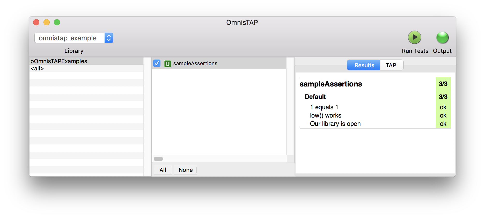
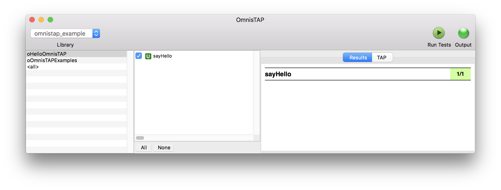

# OmnisTAP
OmnisTAP is a [Test Anything Protocol](https://testanything.org) producer for [Omnis Studio](http://www.omnis.net).

Full documentation is available in the [wiki](https://github.com/suransys/omnistap/wiki).

## Features
* Assertions comparing primitive Omnis types, include lists and row
* Assertions for the existence of classes, libraries, xcomps, and files
* Startup and shutdown methods for a test run
* Setup and teardown methods for each test
* Automatic testing for:
  * Leaking object references
  * Leaking window instances
  * Unit tests running too long
* A full-featured and expressive mocking utility
* Storing, mocking and automatically restoring task variables during a test run
* Running tests in the Omnis IDE
* Running tests from the command-line using [OmnisCLI](https://github.com/suransys/omniscli)

## [TAP specification](https://testanything.org/tap-specification.html) support
Supported:
* Pass (ok) and fail (not ok) assertions
* Diagnostic messages

Not yet supported:
* Plans (OmnisTAP automatically generates a plan for the number of tests run, xUnit-style)
* Bailing out
* Skipping tests (although this is easy to code into your tests)
* Marking tests as TODO (although you can add this note to your test message)

## Requirements
* Omnis Studio 8.1.x
* macOS 10.9+
* Windows 7+

## Examples
### OmnisTAP code
```omnis
Do ioTAP.$ok(1=1,"1 equals 1")
Do ioTAP.$is_char(low("FOO"),"foo","low() works")
Do ioTAP.$isnotclear($libs.$findname("omnistap_example"),"Our library is open")
```
### Raw TAP output
```
1..3
# 2017-09-02 12:19 PM (Unit) Library:omnistap_example Test:_oOmnisTAPExamples/$u_sampleAssertions
ok 1 1 equals 1
ok 2 low() works
ok 3 Our library is open
# 17 ms
```
### OmnisTAP in the IDE


### OmnisCLI
```
Sat Sep 2 13:47:51 2017 Notice: Starting OmnisTAP run on omnistap_example to /Users/aclay/Desktop/tap
Sat Sep 2 13:47:51 2017 Notice: Test timing multiplier is set to 1
Sat Sep 2 13:47:51 2017 Notice: Max timing for unit tests: 5000
Sat Sep 2 13:47:51 2017 Notice: Max timing for integration tests: 90000
Sat Sep 2 13:47:51 2017 Notice: ogTAPManager.$run: ilTests linecount is 1
Sat Sep 2 13:47:51 2017 Notice: Starting up...
Running _oOmnisTAPExamples/$u_sampleAssertions...   [ pass ]
Sat Sep 2 13:47:52 2017 Notice: running tests shutdown
Sat Sep 2 13:47:52 2017 Notice: OmnisTAP run on omnistap_example complete in 1 second to /Users/aclay/Desktop/tap
Sat Sep 2 13:47:52 2017 Notice: Temp folder for this session is /tmp/suran/omnistap25002500/
```

## Installation
Clone this repository to a working directory:
```
git clone https://github.com/suransys/omnistap.git
```

## Quickstart
### Add OmnisTAP to your library
1. Open `omnistap/lib/[your Omnis version]/omnistap.lbs` in Omnis Studio
1. Set your library's startup task to subclass `omnistap.kgTAPTask`
1. Restart your library's startup task

### Add a test
1. Create a object class in your library named `_oHelloOmnisTAP`
1. Set `_oHelloOmnisTAP` to subclass `omnistap.ogTAPSuper`
1. Add the method `$u_sayHello` to `_oHelloOmnisTAP` with this code

        Do ioTAP.$pass("Hello OmnisTAP!")
1. Go to **TAP** -> **Test Current Class**
1. You will see this output:


### Run from the command line
1. Follow the [OmnisCLI](https://github.com/suransys/omniscli) guide to install OmnisCLI
1. Ensure your startup task's construct calls `Do inherited`
1. Ensure `omnistap.lbs`, `omniscli.lbs`, and your library are opened at startup
1. Run this command from a command prompt:

        [path to bin/omniscli] runtests [path to tap output directory]

## Documentation
Please see the [wiki](https://github.com/suransys/omnistap/wiki) for full documentation.

## Contributing
Please see our [guide to contributing](https://github.com/suransys/contributing).